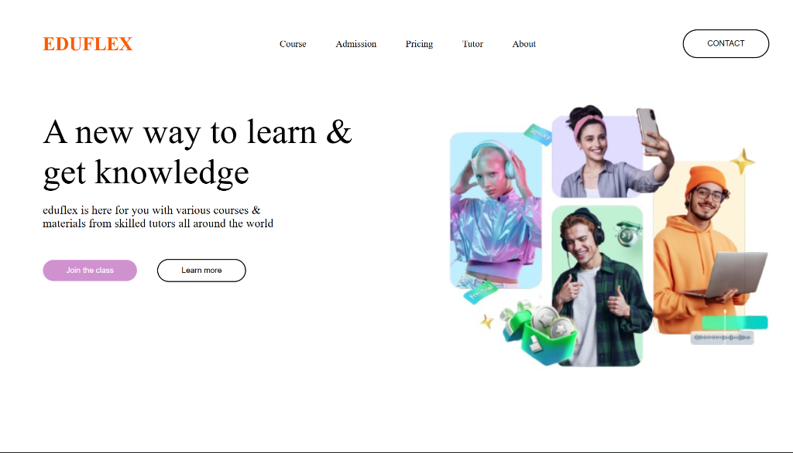

<div align="center">

# 🎓 EDUFLEX — Modern Learning Platform UI

<p align="center">
  <strong>A handcrafted, clean, and elegant educational landing page UI built with pure HTML5 & CSS3 Flexbox.</strong>
</p>

<p align="center">
  
  
  
  
  
</p>

</div>

---

## 📌 Preview

<div align="center">
  
</div>

---

## 📖 Overview

**EDUFLEX** is a clean, minimalist, and modern landing page concept designed for an online education and tutoring platform. 

This project was built from scratch **without using AI code generators, JavaScript frameworks, or CSS libraries** (no Bootstrap, Tailwind, etc.). It serves as a showcase of core front-end fundamentals—focusing on semantic structure, clean flexbox layout composition, typography balance, and modern UI design principles.

---

## ✨ Key Features

- 🎨 **100% Handcrafted Code**: Clean, readable, and written from scratch without AI assistance or external UI frameworks.
- 📐 **Flexbox Powered**: Employs modern CSS Flexbox layout techniques (`justify-content`, `align-items`, `gap`, and flex containers) for alignment and structure.
- 🧭 **Navigation Bar**: Features brand logo, clean navigation links (*Course*, *Admission*, *Pricing*, *Tutor*, *About*), and a pill-shaped contact button.
- 🚀 **Engaging Hero Section**:
  - High-impact headline: *"A new way to learn & get knowledge"*
  - Descriptive sub-headline and dual Call-to-Action (CTA) buttons (*Join the class* & *Learn more*)
  - Quick statistical highlights counter (`9.2K Active`, `4.5K Tutors`, `Resources`) with sleek vertical dividers.
- 🖼️ **Visual Collage Showcase**: Right-side visual collage featuring modern pastel tones, learning badges, and 3D visual accents.
- ⚡ **Zero Dependencies & Lightweight**: Loads instantly in any browser with zero build steps or package installations.

---

## 🎨 Design & Palette

| Element | Color / Hex | Role |
| :--- | :---: | :--- |
| **Brand Identity** | `rgb(250, 91, 6)` | Logo & accent highlights |
| **Primary CTA** | `rgb(207, 146, 207)` | Main action button (*Join the class*) |
| **Secondary Button** | Transparent / Black border | Pill-shaped secondary CTA (*Learn more*, *Contact*) |
| **Background** | `#FFFFFF` | Crisp, clean white canvas |
| **Typography** | `#000000` / `grey` | Primary titles and muted statistical labels |

---

## 📂 Project Structure

```text
UI-PAGE/
├── p1/
│   ├── assets/
│   │   └── img.png          # Hero image collage asset
│   ├── design.css           # Custom CSS styling & flexbox rules
│   └── design.html          # Semantic HTML structure
├── preview.png              # UI preview screenshot
└── README.md                # Project documentation
```

---

## 🚀 Getting Started

You can view and run this project locally in seconds without any build tools:

### 1. Clone the repository
```bash
git clone https://github.com/sachin07-a/UI-PAGE.git
```

### 2. Navigate to the project directory
```bash
cd UI-PAGE/p1
```

### 3. Open in Browser
- Simply double-click `design.html` to open it in your browser (Chrome, Edge, Firefox, Safari, Brave), or
- If you are using **VS Code**, right-click `design.html` and select **"Open with Live Server"**.

---

## 🛠️ Built With

- **HTML5** — Semantic page architecture
- **CSS3** — Custom layout, Flexbox, box model, and styling

---

## 🔮 Future Enhancements

- [ ] Add responsive media queries for smaller mobile and tablet viewports
- [ ] Add smooth hover animations and micro-interactions on CTA buttons and navigation links
- [ ] Add dark mode theme support
- [ ] Implement a mobile hamburger navigation menu

---

## 👤 Author

**Sachin**
- GitHub: [@sachin07-a](https://github.com/sachin07-a)

---

<div align="center">
  <sub>⭐️ If you like this project, feel free to give it a star!</sub>
</div>
